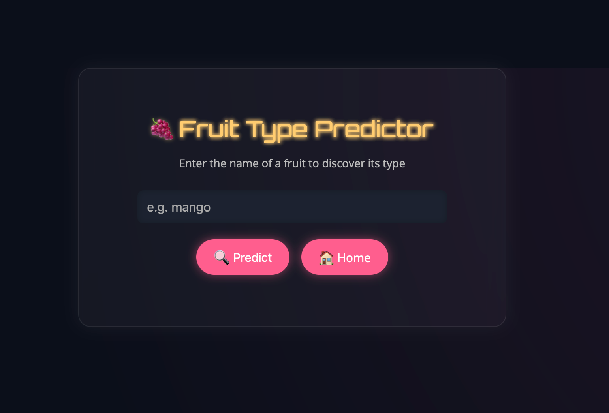

# 🍓 Fruit Genius – Fruit Type Predictor

**[Live Demo →](https://fruit-genius.onrender.com)**  
Predict the type of a fruit based on its name using machine learning (Naive Bayes + TF-IDF). This simple yet smart Flask app is styled with a dark, glassy UI and is ready to deploy on Render or locally.

---

## 📖 Project Overview

The **goal** of Fruit Genius is to:  

✅ Provide an easy-to-use ML-powered app for fruit type prediction.  
✅ Train and deploy a text classifier model in a real web app.  
✅ Demonstrate how to take a Python ML model from local development to production (Render deployment).  

It’s a small-scale but fully functional project that blends data science and web development in one.

---

## 🛠️ Technologies Used

- **Python 3**
- **Flask** – lightweight web framework for backend
- **scikit-learn** – ML model training and prediction
- **TfidfVectorizer** – feature extraction for text
- **Multinomial Naive Bayes** – text classification algorithm
- **HTML5 + CSS3** – Frontend UI
- **Render.com** – For live deployment

---

## 🗝️ Key Features

✅ Predicts fruit type based on the name (Citrus, Berry, Tropical, etc.)  
✅ Handles unknown fruit names gracefully (returns `None`)  
✅ Mobile-responsive, dark-themed UI with glowing buttons  
✅ Deployable anywhere with a `render.yaml` file  
✅ Includes a simple training script (`train_model.py`)  

---

## 📦 Installation

### 1️⃣ Clone the repository
```bash
git clone https://github.com/yourusername/fruit-genius.git
cd fruit-genius
```

### 2️⃣ Create a virtual environment
```bash
python3 -m venv venv
source venv/bin/activate        # On Windows: venv\Scripts\activate
```

### 3️⃣ Install dependencies
```bash
pip install -r requirements.txt
```

### 4️⃣ Train the model
```bash
python train_model.py
```

---

## 🚀 How to Run Locally

Start the Flask app:  

```bash
python app.py
```

The app will be available at:  
**http://127.0.0.1:5000**

---

## 🌐 Deployment (Render)

1. Push your code to GitHub.  
2. Go to [Render.com](https://render.com) and create a new **Web Service**.  
3. Use the following:  
   - **Build Command:**  
     `pip install -r requirements.txt && python train_model.py`
   - **Start Command:**  
     `python app.py`
4. Add Python version in `render.yaml` if needed:  
```yaml
environment:
  pythonVersion: 3.10
```
5. Deploy and get your live URL!  

👉 **Deployed Example:** [https://fruit-genius.onrender.com](https://fruit-genius.onrender.com)

---

## 📁 Project Structure

```
fruit-genius/
├── app.py                 # Flask app
├── train_model.py         # ML model training script
├── model.pkl              # Trained scikit-learn model
├── known_fruits.pkl       # List of known fruit names
├── requirements.txt       # Python dependencies
├── render.yaml            # Render deployment configuration
├── static/
│   └── style.css          # CSS styling
├── templates/
│   └── index.html         # HTML page
└── README.md              # Project documentation
```

---

🖼️ Screenshots

🌟 Homepage



---

## 👨‍💻 Contribution Guidelines

We welcome contributions! 🚀  

1. Fork this repository  
2. Create a feature branch:  
   ```bash
   git checkout -b feature/your-feature-name
   ```
3. Commit your changes:  
   ```bash
   git commit -m "Add your message here"
   ```
4. Push to your forked repo:  
   ```bash
   git push origin feature/your-feature-name
   ```
5. Submit a pull request

---

## 📜 License

This project is licensed under the MIT License © 2025 PritZ (https://github.com/pritzGit)

---

## 🌟 Credits

Made with ❤️ by PritZ (https://github.com/pritzGit)  
Powered by Flask + scikit-learn 🍍